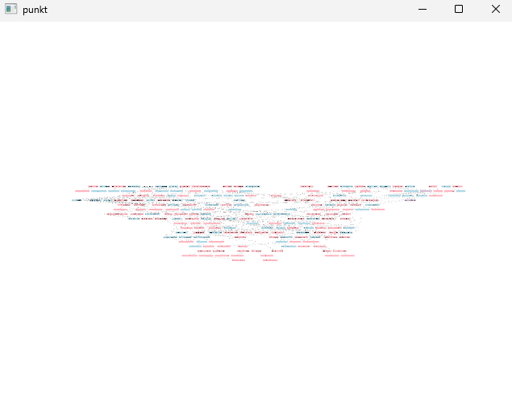
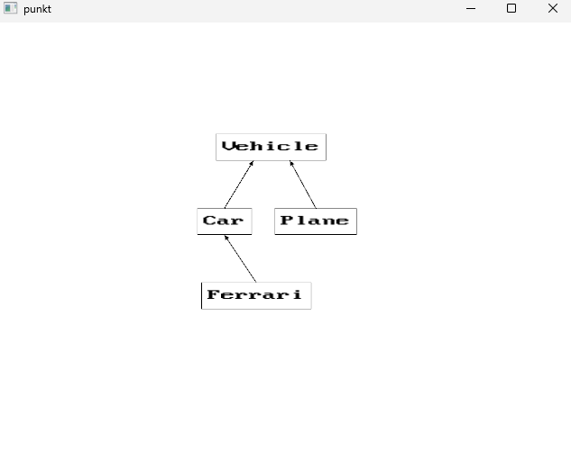
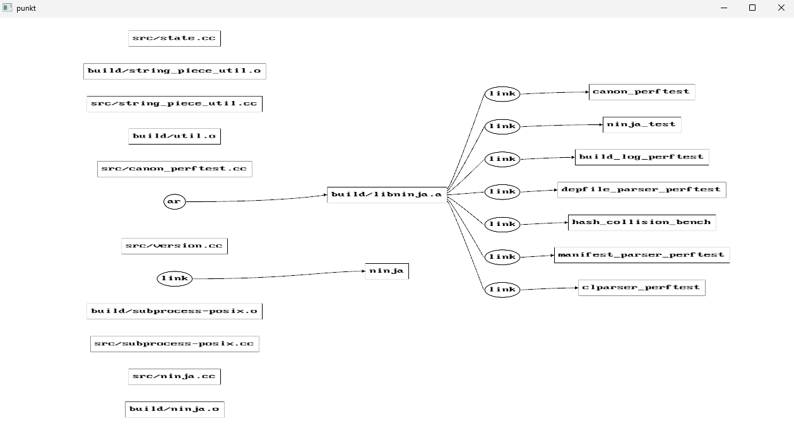
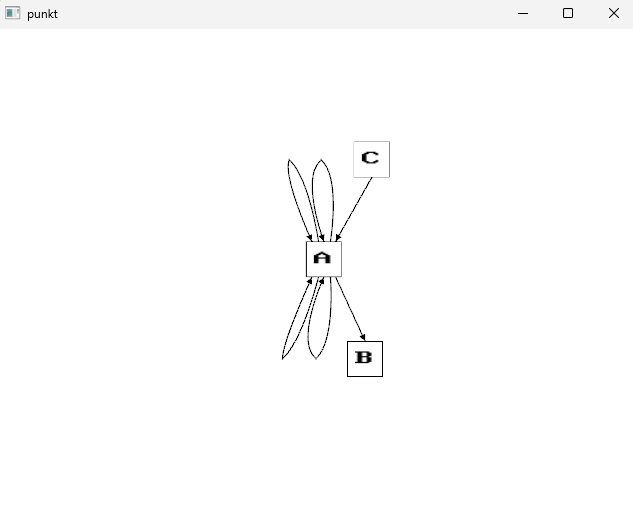
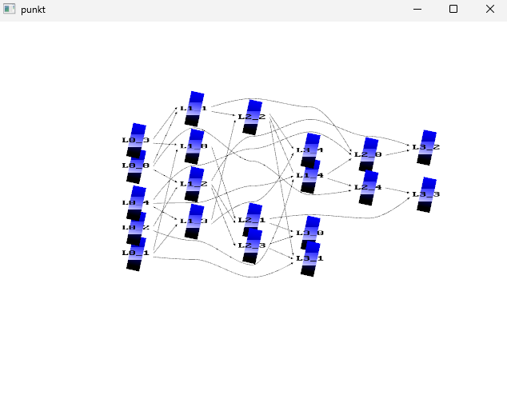

# About
This project is a tiny clone of the dot CLI tool from graphviz using OpenGL.  

Be warned that it is incomplete, has unfinished TODOs and is in no way production ready.
This project turned into a GIT ("goddamn idiotic truckload of sh*t", see [git's README](https://github.com/git/git) at
the very bottom).
I believe the primary reason was the terrible combination that is allowing yourself to
introduce quick hacks and having to experiment with a ton of different settings and potential transformations and
algorithms, and not caring enough to clean up the mess. This thing *really* needs a rewrite. I was actually thinking of
not making  this public at all because of how bad it turned out, but whatever...

There is also lots of dead code in this project because of things I originally wanted to add but simply lost interest
in.

# Demos

# Open TODOs
A ton of stuff in [main.cpp](src/main.cpp) at the bottom (~100 lines!!!), but the most obvious and immediate TODO is
probably the absolute mess in [dot.cpp](src/dot.cpp) and the fact the horizontal layout optimization pipeline seems kind
of broken. By broken, I mean that the results often look like utter crap (see
[siblings.dot](examples/graphviz_gallery/siblings.dot)).

# License
[MIT License](LICENSE)